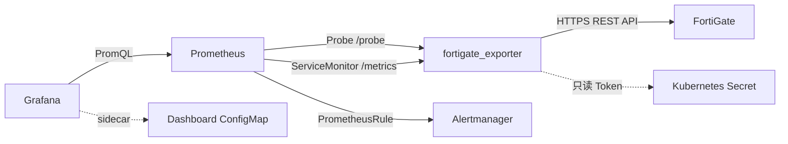

# fortigate-exporter Helm Chart

面向 Kubernetes 的
[`prometheus-community/fortigate_exporter`](https://github.com/prometheus-community/fortigate_exporter)
Helm Chart，集成 Prometheus Operator、告警规则和通用 Grafana Dashboard。

本项目只负责部署与监控集成，不包含或修改上游 exporter 源码。当前 Chart 使用
`fortigate_exporter v1.25.0`，镜像同时固定 tag 和多架构 digest。

上游应用、Dashboard 等应用资产使用官方名称 `fortigate_exporter`。Helm Chart
目录、Chart name、helper、release 及 Kubernetes/Grafana API 资源名使用
DNS-1123 合法名称 `fortigate-exporter`；上游实际发布的 Quay 镜像路径同样使用
`fortigate-exporter`。

## 功能

- 每个 FortiGate 对应一个 Prometheus Operator `Probe`；
- 使用 `ServiceMonitor` 采集 exporter 自身 `/metrics`；
- 使用 `PrometheusRule` 提供可用性、资源、证书、IPsec、接口和 WAN 告警；
- 通过 Grafana sidecar ConfigMap 下发多设备 Dashboard；
- API Token 只从外部 Kubernetes Secret 读取，不进入 Helm values 或 release 历史；
- 支持私有 CA，默认不跳过 FortiGate TLS 证书校验；
- 默认启用非 root、只读根文件系统、Drop ALL capabilities 和 seccomp。



## 部署资源

| 资源 | 作用 |
|---|---|
| `Deployment` | 运行 fortigate_exporter |
| `Service` | 暴露 exporter 的 `/metrics` 和 `/probe` |
| `ServiceAccount` | Pod 身份；默认不挂载 Kubernetes API Token |
| `ServiceMonitor` | 采集 exporter 自身运行状态 |
| `Probe` | 每个 `targets[]` 生成一个 FortiGate 探测任务 |
| `PrometheusRule` | 生成 Prometheus 告警规则 |
| `ConfigMap` | 保存 Grafana Dashboard，由 sidecar 发现 |

Chart 不创建 namespace、Prometheus Operator CRD、Prometheus、Alertmanager、
Grafana、FortiGate Token Secret 或私有 CA ConfigMap。

## 前置条件

- Kubernetes 集群；
- Helm 4.2+；
- 已安装 Prometheus Operator CRD；
- 已运行 Prometheus、Alertmanager 和 Grafana，例如 kube-prometheus-stack；
- Grafana 13+，用于项目内的 Dashboard v2 resource；
- FortiGate HTTPS 管理接口可从 exporter Pod 的网络出口访问；
- Node.js 22，仅供本地或 CI 校验 Dashboard，不参与 Kubernetes 运行。

## 1. 创建 FortiGate REST API 用户

FortiGate 只支持 Token 方式的 API 认证，生产环境应使用 HTTPS、独立只读 API
用户、Trusted Hosts 和最小权限。只有 `super_admin` 能创建 REST API 用户；
Token 只显示一次，应立即保存到密码管理系统。

FortiOS 命令会因版本、设备型号和 VDOM 模式不同而变化。执行前先在目标设备上
通过 `set ?` 检查可用字段，并在测试设备验证。

### 1.1 创建只读权限配置

下面的配置覆盖 exporter v1.25.0 的主要 probes：

```text
config system accprofile
    edit "prometheus-readonly"
        set comments "Read-only profile for fortigate_exporter"
        set authgrp read
        set fwgrp custom
        set loggrp custom
        set netgrp custom
        set sysgrp custom
        set vpngrp read
        set wifi read
        config fwgrp-permission
            set policy read
            set others read
        end
        config netgrp-permission
            set cfg read
            set route-cfg read
        end
        config loggrp-permission
            set config read
        end
        config sysgrp-permission
            set cfg read
        end
    next
end
```

版本差异：

- 多 VDOM 且需要采集所有 VDOM 时，在 profile 中增加 `set scope global`；单 VDOM
  设备或不支持 global scope 的设备不要设置；
- 某些 FortiOS 版本不支持 `fwgrp-permission others`。如果需要
  `Firewall/LoadBalance`，可以改为 `set fwgrp read`，但权限范围更大；不需要时应
  从认证文件排除该 probe；
- FortiOS 7.4 的 `wifi` 权限同时管理 WiFi Controller 和 Switch Controller。
  如果 `Switch/ManagedSwitch` 在其他固件上返回 403，请检查该版本对应的
  Switch Controller 只读权限，或排除该 probe；
- 不需要为 exporter 开启 CLI diagnose、execute 或写权限。

权限与指标的主要对应关系：

| 权限 | exporter probes / Dashboard 内容 |
|---|---|
| 基础 API 访问 | 设备状态、版本、License、证书、接口光模块 |
| `sysgrp.cfg` | CPU、内存、时间、HA、传感器、Link Monitor、VDOM 资源 |
| `netgrp.cfg` | 接口、NTP、SD-WAN 健康检查 |
| `netgrp.route-cfg` | BGP IPv4/IPv6 邻居和路径 |
| `fwgrp.policy` | 防火墙策略、IP Pool |
| `fwgrp.others` | 负载均衡服务器 |
| `loggrp.config` | 日志磁盘、FortiAnalyzer 状态和队列 |
| `authgrp` | FSSO |
| `vpngrp` | IPsec、SSL VPN |
| `wifi` / 固件对应权限 | FortiAP、WiFi 客户端、受管 FortiSwitch |

完整的 probe、权限和 API 路径映射见上游
[`v1.25.0 README`](https://github.com/prometheus-community/fortigate_exporter/blob/v1.25.0/README.md#fortigate-configuration)。
未授权的 probe 通常记录 403 并缺失对应指标，不会阻止其他 probe 工作。

### 1.2 创建 API 用户和 Trusted Host

将示例地址 `192.0.2.10` 替换为 FortiGate 实际看到的 exporter 出口源地址。它
通常是 Kubernetes 节点地址、NAT 出口地址或固定 egress gateway 地址，不一定是
Pod IP。

```text
config system api-user
    edit "prometheus-exporter"
        set comments "Read-only monitoring for fortigate_exporter"
        set accprofile "prometheus-readonly"
        set vdom "root"
        config trusthost
            edit 1
                set ipv4-trusthost 192.0.2.10 255.255.255.255
            next
        end
    next
end
```

多 VDOM 环境按实际监控范围调整 `set vdom`。不要把 Trusted Hosts 配置为全网
开放；同时应使用 local-in policy 或上游防火墙限制管理接口来源。

生成 Token：

```text
execute api-user generate-key prometheus-exporter
```

支持 Token 到期时间的 FortiOS 可以指定 1–10080 分钟，例如：

```text
execute api-user generate-key prometheus-exporter 10080
```

生成新 Token 会使旧 Token 失效。轮换前应准备 Kubernetes Secret 更新和
Deployment 重启窗口。

### 1.3 验证 Token

优先通过 `Authorization: Bearer` 请求头传递 Token，不要把 Token 放入 URL、
终端历史或日志：

```bash
read -s FGT_API_TOKEN
curl --fail --silent --show-error \
  --header "Authorization: Bearer ${FGT_API_TOKEN}" \
  https://fortigate.example.internal/api/v2/monitor/system/status
unset FGT_API_TOKEN
```

私有 CA 环境使用 `--cacert .local/ca.crt`。不要把 `--insecure` 作为生产方案。

Fortinet 官方参考：

- [Using APIs](https://docs.fortinet.com/document/fortigate/latest/administration-guide/940602/using-apis)
- [REST API administrator](https://docs.fortinet.com/document/fortigate/7.4.6/administration-guide/399023/rest-api-administrator)
- [FortiOS 7.4.6 `config system accprofile`](https://docs.fortinet.com/document/fortigate/7.4.6/cli-reference/309990135/config-system-accprofile)

## 2. 准备 Kubernetes 配置

认证文件的目标 URL 和 Helm values 中的 `targets[].url` 必须完全一致，包括端口，
且不能包含路径或末尾 `/`。认证文件只保存 Token 和可选 probe 过滤；Helm values
只保存非敏感的目标名称、URL 和标签。

不要提交生产 IP、Token、序列号、Trusted Hosts、私有 CA 或业务名称。
`.local/` 与 `values-targets.yaml` 已被 Git 和 Helm 打包忽略。

### 2.1 创建认证文件

```bash
mkdir -p .local
chmod 0700 .local
```

创建 `.local/fortigate-key.yaml`：

```yaml
"https://fortigate.example.internal":
  token: REPLACE_WITH_READ_ONLY_API_TOKEN
```

不需要某类指标时，按上游 probe 名称过滤。匹配区分大小写并使用前缀：

```yaml
"https://fortigate.example.internal":
  token: REPLACE_WITH_READ_ONLY_API_TOKEN
  probes:
    include:
      - System
      - VPN
      - VirtualWAN
    exclude:
      - System/SensorInfo
```

未配置 `probes` 时默认运行全部 probes。只授予已启用 probes 所需的权限。

```bash
chmod 0600 .local/fortigate-key.yaml
```

### 2.2 创建外部 Secret

```bash
kubectl create secret generic fortigate-exporter-auth \
  --namespace monitoring \
  --from-file=fortigate-key.yaml=.local/fortigate-key.yaml \
  --dry-run=client -o yaml \
  | kubectl apply --server-side -f -
```

Chart 只引用该 Secret，不会读取或保存明文 Token 到 Helm release。

### 2.3 配置目标

创建不会提交到 Git 的 `values-targets.yaml`：

```yaml
targets:
  - name: fortigate-shanghai
    url: https://fortigate.example.internal
    labels:
      site: shanghai
      environment: production
```

多设备时，为每台设备添加独立 `targets[]` 和认证文件条目。`name` 会成为稳定的
`fortigate_device` 标签，修改后会影响 Dashboard 变量和告警选择器。

```bash
chmod 0600 values-targets.yaml
```

### 2.4 可选：私有 CA

```bash
kubectl create configmap fortigate-ca \
  --namespace monitoring \
  --from-file=ca.crt=.local/ca.crt \
  --dry-run=client -o yaml \
  | kubectl apply --server-side -f -
```

在 `values-targets.yaml` 中增加：

```yaml
extraCA:
  existingConfigMap: fortigate-ca
  key: ca.crt
  revision: "1"
```

仅临时测试才使用 `exporter.insecureSkipVerify: true`。

## 3. 使用 Helm Chart 部署

以下命令从仓库根目录执行。

### 3.1 本地验证

```bash
make validate
```

验证包括 Dashboard 静态检查、Helm schema、默认 values、脱敏目标模板渲染和
错误配置拒绝测试。

### 3.2 安装或升级

```bash
helm upgrade --install fortigate-exporter fortigate-exporter \
  --namespace monitoring \
  --values values-targets.yaml \
  --rollback-on-failure \
  --wait \
  --timeout 10m
```

默认 `monitoringLabels.release=kube-prometheus-stack`。如果 Prometheus 的
`serviceMonitorSelector`、`probeSelector` 或 `ruleSelector` 使用其他标签，必须
在 values 中同步修改：

```yaml
monitoringLabels:
  release: my-monitoring-stack
```

### 3.3 检查资源

```bash
kubectl get deployment,service,configmap,probe,servicemonitor,prometheusrule \
  --namespace monitoring \
  --selector app.kubernetes.io/instance=fortigate-exporter

kubectl logs \
  --namespace monitoring \
  deployment/fortigate-exporter
```

Prometheus 中至少应满足：

```promql
up{job="fortigate_exporter"} == 1
up{job="fortigate"} == 1
probe_success{job="fortigate"} == 1
```

含义：

- `up{job="fortigate_exporter"}=0`：Prometheus 无法采集 exporter 自身；
- `up{job="fortigate"}=0`：调用 `/probe` 失败或超时；
- `up=1` 且 `probe_success=0`：请求到达 exporter，但 FortiGate API 全部或部分失败；
- 日志出现 401：Token 无效或已过期；
- 日志出现 403：API 用户权限、VDOM 范围或 Trusted Hosts 不匹配；
- TLS 错误：补充私有 CA、修复证书 SAN 或证书链，不要长期跳过校验。

## 4. PrometheusRule 与 Alertmanager 告警

Prometheus 负责执行 PromQL 规则并生成 alert，Alertmanager 负责分组、抑制和发送。
因此本 Chart 创建的是 `PrometheusRule`，不会修改现有 Alertmanager receiver、
邮件、Webhook、企业微信或 Slack 配置。

### 4.1 默认启用规则

| 告警 | 默认条件 | 级别 |
|---|---|---|
| `FortiGateExporterDown` | exporter 采集失败 5 分钟 | critical |
| `FortiGateProbeRequestFailed` | `/probe` 请求失败 3 分钟 | critical |
| `FortiGateAPIUnavailable` | API 不可用 3 分钟 | critical |
| `FortiGateProbePartialFailure` | 部分 probe 失败 5 分钟 | warning |
| `FortiGateProbeTargetsMissing` | 实际目标数少于配置 5 分钟 | warning |
| `FortiGateProbeSlow` | 探测超过 25 秒并持续 10 分钟 | warning |
| `FortiGateHighCPU` | CPU 高于 90% 持续 10 分钟 | warning |
| `FortiGateHighMemory` | 内存高于 90% 持续 10 分钟 | warning |
| `FortiGateClockSkew` | 时钟偏差超过 120 秒持续 10 分钟 | warning |
| `FortiGateLogDiskHighUsage` | 日志盘超过 85% 持续 30 分钟 | warning |
| `FortiGateCertificateExpiringSoon` | 在用有效证书 30 天内到期 | warning |
| `FortiGateCertificateExpiringCritical` | 在用有效证书 7 天内到期 | critical |
| `FortiGateVDOMLicenseNearLimit` | VDOM 使用达到授权的 90% | warning |

### 4.2 按业务显式启用的规则

IPsec、关键接口和 WAN 合同带宽规则默认关闭，避免把按需隧道、未使用物理口或
错误带宽值当成故障。示例：

```yaml
prometheusRule:
  ipsecTunnels:
    mustStayUp:
      - device: fortigate-shanghai
        vdom: root
        phase1: IPsecToDatacenter
        phase2: Datacenter-Network

  criticalInterfaces:
    deviceAliasRegex:
      fortigate-shanghai: "^(WAN|MPLS)$"
    down:
      enabled: true
      for: 2m
      severity: critical
    errorRatio:
      enabled: true
      thresholdRatio: 0.01
      minimumPacketsPerSecond: 10
      for: 10m
      severity: warning

  wanBandwidth:
    devices:
      fortigate-shanghai:
        aliasRegex: "^WAN$"
        downstreamKbps: 100000
        upstreamKbps: 50000
```

注意：

- `device` 必须与 `targets[].name` 完全一致；
- IPsec 的 `vdom`、`phase1`、`phase2` 必须匹配实际指标标签；
- 接口 link 指标没有 admin state，必须使用业务 alias/name 白名单；
- WAN 带宽使用十进制 Kbps，`1 Kbps = 1000 bit/s`。

### 4.3 配置 Alertmanager 路由

将下面的路由片段合并到现有 Alertmanager 配置，并替换 receiver。不要覆盖已有的
顶层 `route` 和默认 receiver：

```yaml
route:
  routes:
    - receiver: fortigate-critical
      matchers:
        - alertname=~"FortiGate.*"
        - severity="critical"

receivers:
  - name: fortigate-critical
    webhook_configs:
      - url: https://alert-relay.example.internal/fortigate
        send_resolved: true
```

具体注入方式取决于监控栈：可以修改 Alertmanager 原生 Secret，也可以使用
Prometheus Operator `AlertmanagerConfig`。Webhook 凭据应保存在 Secret 中。

验证规则是否被 Prometheus 选中：

```bash
kubectl get prometheusrule \
  --namespace monitoring \
  --selector app.kubernetes.io/instance=fortigate-exporter
```

在 Prometheus 的 **Status > Rules** 中检查 `fortigate_exporter.*` 规则组，在
Alertmanager 中确认 `FortiGate*` alert 能匹配预期 route。

## 5. Grafana Dashboard

Chart 默认创建带有以下标签的 ConfigMap：

```yaml
grafana_dashboard: "1"
```

Grafana sidecar 发现后加载 `FortiGate Prometheus Exporter`。如果 sidecar 使用
其他选择标签，调整 `grafanaDashboard.labels`。

Dashboard 文件：
[`grafana/fortigate_exporter-overview.json`](grafana/fortigate_exporter-overview.json)

Dashboard 的通用性设计：

- Prometheus 数据源可选择，不绑定 datasource UID；
- 设备查询使用 Chart 生成的 `job` 和 `fortigate_device` 标签，不依赖暴露管理
  地址的 `instance`；
- 变量按 `job → device → VDOM → 业务对象` 链式过滤；
- 支持多设备、多 VDOM、接口、IPsec Phase1/Phase2、SD-WAN、FortiSwitch 和
  WiFi 客户端；
- HA virus/IPS 累计 counter 使用 `rate()` 展示，避免把累计值误当速率；
- `Collection Health` 单独显示探测状态、探测耗时和最近成功时间。

Dashboard 行：

| 行 | 内容 |
|---|---|
| Collection Health | Probe 成功率、耗时、最后成功时间 |
| System | 版本、运行时间、CPU、内存、会话、时间、证书、License |
| HA Cluster | HA 成员状态与事件速率 |
| Interface | 链路、速率、流量、错误包 |
| Logs | 日志磁盘与 FortiAnalyzer |
| FortiWifi | AP 和客户端 |
| FortiSwitch | 受管交换机 |
| Policies | IPv4/IPv6 策略流量 |
| VPN | IPsec 和 SSL VPN |
| SD-WAN | 成员状态、时延、丢包、抖动 |

某一行显示 `No data` 通常表示设备不支持该功能、probe 被过滤或 API 用户缺少对应
权限，不代表整个 exporter 失败。先查看 `Collection Health` 和 exporter 日志。

上游指标定义见
[`metrics.md`](https://github.com/prometheus-community/fortigate_exporter/blob/v1.25.0/metrics.md)。

## 6. `scripts` 是什么

项目只保留一个开发校验脚本：
[`scripts/validate-dashboard.mjs`](scripts/validate-dashboard.mjs)。

它的作用是对 Grafana Dashboard 做确定性的静态检查：

- JSON 可解析，且使用预期的 Grafana v2 schema 和稳定 metadata；
- 变量、Prometheus datasource 和 panel/layout 引用完整；
- 所有 PromQL 使用 `$datasource`、`job` 和 `fortigate_device`；
- VDOM、IPsec、SD-WAN、WiFi 和 HA counter 查询符合约束；
- PromQL 引号和花括号平衡；
- 不包含私网 IP、Grafana 用户信息、resourceVersion 或 UI 临时状态。

脚本由 `make dashboard` 和 `make validate` 调用，GitHub Actions 也执行
`make validate`。它只读取仓库中的 JSON，不访问 FortiGate、Kubernetes 或网络，
不会修改文件，也不会被打入 Helm Chart 包。Node.js 只为运行这个脚本而需要。

## 7. 主要配置

| 参数 | 默认值 | 说明 |
|---|---|---|
| `image.tag` | `v1.25.0` | 上游 exporter 版本 |
| `auth.existingSecret` | `fortigate-exporter-auth` | 外部认证 Secret |
| `auth.revision` | `"1"` | Secret 更新后递增以触发滚动重启 |
| `extraCA.existingConfigMap` | `""` | 可选私有 CA ConfigMap |
| `exporter.insecureSkipVerify` | `false` | 是否跳过 FortiGate TLS 校验 |
| `monitoringLabels.release` | `kube-prometheus-stack` | Operator 资源发现标签 |
| `serviceMonitor.enabled` | `true` | 采集 exporter 自身指标 |
| `probe.enabled` | `true` | 为目标创建 Probe |
| `probe.interval` | `60s` | FortiGate 采集间隔 |
| `grafanaDashboard.enabled` | `true` | 创建 Dashboard ConfigMap |
| `prometheusRule.enabled` | `true` | 创建告警规则 |

完整参数和类型约束见 [`values.yaml`](values.yaml) 与
[`values.schema.json`](values.schema.json)。

## Token 和 CA 轮换

Exporter 只在启动时读取认证文件和 CA：

1. 更新外部 Secret 或 CA ConfigMap；
2. 在私有 values 中递增 `auth.revision` 或 `extraCA.revision`；
3. 执行 `helm upgrade`；
4. 等待 Pod 滚动完成并检查 `probe_success`；
5. 确认新 Token 正常后撤销旧 Token。

不要只更新 Secret 而不重启 Pod。

## 项目结构

```text
fortigate-exporter/
├── .helmignore
├── Chart.yaml
├── CHANGELOG.md
├── README.md
├── grafana/fortigate_exporter-overview.json
├── scripts/validate-dashboard.mjs
├── templates/
├── values.schema.json
└── values.yaml
```

## 本地验证和打包

```bash
make validate
make package
```

`make validate` 执行 Dashboard 检查、严格 Helm lint 和两组模板渲染。`make package`
生成 `dist/*.tgz`；`.local/`、`values-targets.yaml`、脚本和 CI 文件不会进入包。

## 安全检查清单

- 每台设备使用独立、只读、最小权限 API 用户；
- Trusted Hosts 限制为实际固定出口地址；
- Token 和私有 CA 不提交 Git，不写入 Helm values；
- 限制读取 `fortigate-exporter-auth` Secret 的 Kubernetes RBAC；
- 生产环境保持 `insecureSkipVerify: false`；
- 设置 Token 轮换、到期和撤销流程；
- 通过 NetworkPolicy、防火墙或 local-in policy 限制 exporter 与管理面的流量；
- 修改告警接收配置前先在测试 receiver 验证。

## License

本部署项目采用 [Apache License 2.0](../../LICENSE)。FortiGate 和 Fortinet 是
Fortinet, Inc. 的注册商标；上游 exporter 不是 Fortinet 官方产品。
